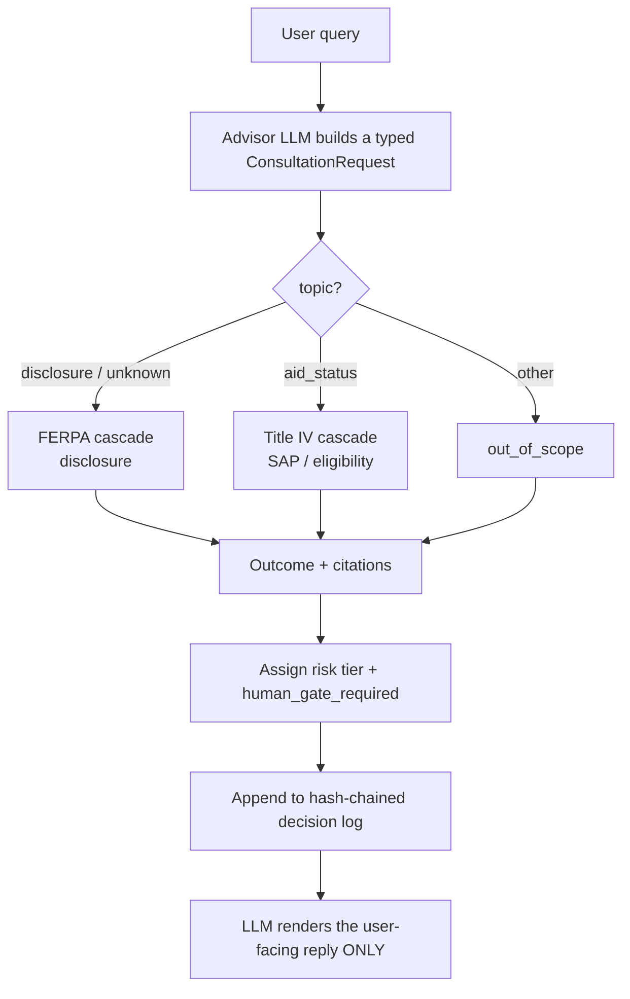

# RegRails

> **Codify federal regulations into machine-readable rules. Wire them into an AI advisor as a deny-by-default, risk-tiered guardrail. Keep the audit trail honest.**

A proof-of-concept for turning institutional-policy and regulatory requirements into machine-readable logic an AI system consults *before* it answers — the "policy-as-code" pattern for AI-in-the-loop governance. It encodes two U.S. higher-education frameworks and ships a working AI-advisor guardrail demo:

- **FERPA** — 34 CFR Part 99, Subpart D (education-record disclosure)
- **Title IV** — 34 CFR Part 668 subset: Satisfactory Academic Progress (§ 668.34) + student eligibility (§ 668.32)

**37 machine-readable rules across 8 sections**, each pinned to verbatim CFR text by a faithfulness gate; a deterministic engine that emits a typed `GuardrailDecision` with a **risk tier** and a **human-gate** flag; tamper-evident **hash-chained decision provenance**; and a **22-scenario golden corpus** with a published coverage matrix. Apache-2.0, Python 3.12+, `uv`-managed. 159 tests; ruff + mypy-strict clean.

> This is a proof-of-concept, not a compliance product and not legal advice. It encodes *selected* provisions with verbatim traceability for the rules included, and routes high-stakes determinations to a human. See **[Limitations](#limitations)**.

---

## The idea: what AI may automate vs. what needs a human

Every decision is tagged with a **risk tier** derived from reversibility and blast radius:

- **low / reversible** → safe to automate (e.g., explaining a rule, an out-of-scope question).
- **medium** → automate with a cited obligation or a quick check (consent, directory opt-out).
- **high / irreversible** → **mandatory human gate.** Loss of aid eligibility, loan default, a yes/no eligibility determination — the engine refuses to let the AI answer and routes to a human (the financial-aid office).

That boundary — *what an AI can automate and what requires human judgment or institutional policy logic* — is the whole point. The AI never makes the high-stakes call; it consults the rules, and a human owns the irreversible ones.

---

## What the demo shows

`python -m regrails.demo --all` runs 12 scenarios across both frameworks. The decision (outcome + risk tier + human gate + citations) is **100% deterministic and made before any LLM call**; the LLM only renders the user-facing reply. Full transcripts: [`demo/recorded-runs/`](demo/recorded-runs/); browsable HTML: [`docs/decision-report.html`](docs/decision-report.html); full table: [`docs/demo-output.md`](docs/demo-output.md).

| # | Framework | Query (abridged) | Outcome | Risk | Human gate | Cite |
|---|---|---|---|---|---|---|
| 1 | FERPA | "What's Jane Doe's GPA?" | **block** | medium | — | § 99.30 |
| 2 | FERPA | Outsourced AI tutor wants test scores | **escalate_consent** | medium | — | § 99.31(a)(1)(i)(B) |
| 3 | FERPA | "What's the basketball roster?" | **escalate_directory_check** | medium | — | § 99.37 |
| 4 | FERPA | Aggregate, de-identified grad rates | **allow** | low | — | § 99.31(b)(1) |
| 5 | FERPA | Health/safety emergency, homeroom addresses | **allow** | medium | — | § 99.36 + § 99.32 |
| 6 | FERPA | Parent asks for the disclosure log | **allow** | low | — | § 99.32 |
| 7 | FERPA | Forward transcripts received elsewhere | **block** | medium | — | § 99.33 |
| 8 | Title IV | "I defaulted — am I still eligible?" | **escalate_human_review** | high | **YES** | § 668.32(g)(1) |
| 9 | Title IV | "I failed SAP — will I keep my Pell grant?" | **escalate_human_review** | high | **YES** | § 668.34(a)(7) |
| 10 | Title IV | "What does financial aid warning mean?" | **allow** | medium | — | § 668.34(a)(8)(i) |
| 11 | Title IV | "Will I get aid next semester?" (no facts) | **insufficient_facts** | low | — | § 668.34(a)(3) |
| 12 | — | "What time does the library close?" | **out_of_scope** | low | — | — |

Seven outcomes: `allow` · `block` · `escalate_consent` · `escalate_directory_check` · `escalate_human_review` · `insufficient_facts` · `out_of_scope`.

---

## How it works



The deterministic engine ([`guardrail.py`](src/regrails/guardrail.py)) decides; the LLM ([`llm.py`](src/regrails/llm.py)) only phrases the reply. You can see the boundary directly — run the engine with **no LLM at all**:

```bash
regrails decide --query "I defaulted on a loan; am I eligible for aid?" \
  --topic aid_status --aid-determination --in-default
# -> {"outcome": "escalate_human_review", "risk_tier": "high",
#     "human_gate_required": true, "citations_emitted": ["34-CFR-668.32(g)(1)"], ...}
```

---

## Verifiable by design

- **Faithfulness gate** — every rule's `source_quote` must appear verbatim in the bundled CFR text (token coverage ≥ 0.85). `regrails check faithfulness` → **37/37 pass**. Combined with a SHA-256 over each bundled section, there's a tamper-evident chain from public CFR text → bundle → encoded rule.
- **Golden corpus + coverage matrix** — 22 scenarios pin `(outcome, risk_tier, human_gate, citations)` for concrete fact patterns ([`tests/golden/`](tests/golden/)). `regrails coverage report` builds a rule→scenario traceability matrix and **flags rules no scenario exercises** ([`docs/COVERAGE.md`](docs/COVERAGE.md)) — coverage *and gaps* are visible, not hidden.
- **Hash-chained decision provenance** — every decision can be appended to a tamper-evident log; `regrails audit verify <log>` recomputes the chain and detects any edit, insertion, or deletion. (Echoes the cryptographic evidence-binding in [Evidentia](#built-by-the-author-of-evidentia), at POC scale: no keys, just a verifiable chain.)

---

## Research-grounded

The encoded rules are grounded by live research streams (Perplexity Sonar deep research + a GPT-5.5 / Gemini 3.1 Pro / Grok 4.3 triangulation), committed to [`research/snapshots/`](research/snapshots/). They surfaced the real-world hooks the encoding leans on: the FERPA "school official" safe-harbor test for outsourced AI vendors (§ 99.31(a)(1)(i)(B)), the § 99.31(a)(6) studies exception, § 99.37 directory opt-out mechanics, and that **policy-as-code with audit trails + human-in-the-loop** (commonly via OPA/Rego) is the recommended pattern in regulated student-facing AI.

---

## Quickstart

```bash
git clone https://github.com/Polycentric-Labs/regrails.git && cd regrails
uv sync --extra dev

uv run regrails check faithfulness          # 37/37 rules verbatim-faithful
uv run regrails encode list                 # all 37 rules (FERPA + Title IV)
uv run regrails decide -q "What's Jane's GPA?" --data gpa   # pure engine, no LLM
uv run regrails coverage report             # rule -> scenario matrix (+ gaps)
uv run regrails report html                 # build docs/decision-report.html

# Demo (needs OPENROUTER_API_KEY, or a key file at ~/.secrets/openrouter.env):
uv run python -m regrails.demo --all
# Replay the recorded demo WITHOUT an API key:
uv run python -m regrails.demo --replay demo/recorded-runs/
uv run regrails audit verify demo/recorded-runs/decisions.chain.jsonl

uv run pytest -q                            # 159 tests
```

---

## How this maps to the role

This POC was built for the Gates Foundation *Senior Program Officer, AI-Enabled Engagement Systems* charter. The mapping is deliberate:

| Role asks for | RegRails shows |
|---|---|
| "codify institutional policy and workflows into machine-readable logic, ensuring alignment with regulatory requirements (e.g., FERPA, Title IV)" | 37 machine-readable rules across **FERPA and Title IV**, faithfulness-pinned to source text |
| "auditability, AI-in-the-loop governance" | hash-chained decision provenance + `audit verify`; the LLM is a renderer, the engine decides |
| "the boundary between what AI can automate and what requires human judgment or institutional policy logic" | the **risk-tier + human-gate** model: irreversible/high-stakes → mandatory human gate |
| "policy-as-code frameworks" | a working policy-as-code engine with a coverage/traceability matrix |
| "AI public goods" | Apache-2.0, runnable offline, no license cost — built for lower-resourced institutions |

---

## Project layout

```
regrails/
├── data/{cfr,encoded}/          # verbatim CFR text + encoded YAML rules (FERPA + Title IV)
├── research/snapshots/          # committed Sonar research-stream JSON
├── demo/{queries.yaml,recorded-runs/}   # 12 scenarios + replayable transcripts + hash chain
├── docs/{COVERAGE.md,decision-report.html,demo-output.md}
├── src/regrails/
│   ├── models.py        # 5 Pydantic models + RiskTier + 7 outcomes
│   ├── encode.py        # multi-framework loader
│   ├── faithfulness.py  # verbatim-text gate (Jaccard / coverage)
│   ├── guardrail.py     # decide(): FERPA + Title IV cascades, risk tiering
│   ├── audit.py         # event log + hash-chained provenance
│   ├── llm.py           # advisor renderer (OpenRouter; retry + fallback)
│   ├── coverage.py · report.py · demo.py
│   └── cli/             # regrails {check, encode, decide, coverage, audit, report, research}
└── tests/               # 159 tests incl. golden corpus + tamper-detection
```

---

## Limitations

A weekend proof-of-concept is not a production system, and saying so plainly is part of the point.

- **Selected provisions, not full coverage.** Two frameworks, eight sections, 37 rules. FERPA has more subparts; Part 668 is far larger. The architecture generalizes; adding more is authoring, not redesign. The coverage matrix shows exactly which rules are and aren't exercised.
- **Verbatim-text faithfulness only.** The gate proves each `source_quote` matches the CFR text. It does **not** prove the *semantic* encoding (`rule_type`, `triggers`, risk tier) is a correct legal reading — that needs review by an institutional FERPA/financial-aid officer.
- **Not "compliant," not legal advice, not production-ready.** It creates auditable guardrails and escalation paths; it does not certify compliance or prevent violations. High-stakes cases require human review by design.
- **The LLM only renders text.** It never makes a decision. All decisions come from the deterministic engine and are reproducible without any model.
- **Synthetic data only.** No real student records exist anywhere here ([`SYNTHETIC_DATA.md`](SYNTHETIC_DATA.md)).

---

## Built by the author of Evidentia

By [Allen Byrd](https://github.com/allenfbyrd), author of **[Evidentia](https://github.com/Polycentric-Labs/evidentia)** — a 446-commit open-source GRC platform with bundled framework catalogs (NIST 800-53, FFIEC, ISO 27001, ISO 42001, NIST AI RMF, OWASP LLM/Agentic Top 10, OSCAL/OCSF/SARIF), Sigstore-signed verifiable AI outputs, an MCP server, and supply-chain-attested PyPI releases under OpenSSF Best Practices. RegRails reuses Evidentia's patterns directly: Pydantic models with `extra="forbid"`, a Jaccard verbatim-faithfulness gate, a string-valued `EventAction` audit enum, Typer CLI sub-commands, and provider-agnostic, env-file secret loading that never routes a key through tool context.

The thesis: regulations *are* code, and the primitives for representing them as machine-readable, auditable, AI-consultable artifacts already exist. RegRails is one weekend-sized worked example, extended to two frameworks.

## License

Apache-2.0. See [LICENSE](LICENSE).

## AI assistance

This project was developed alongside AI platforms.

Models used: Claude Opus 4.8, GPT-5.5, Gemini 3.1 Pro, Grok 4.3, Perplexity Sonar (Deep Research + Pro)
